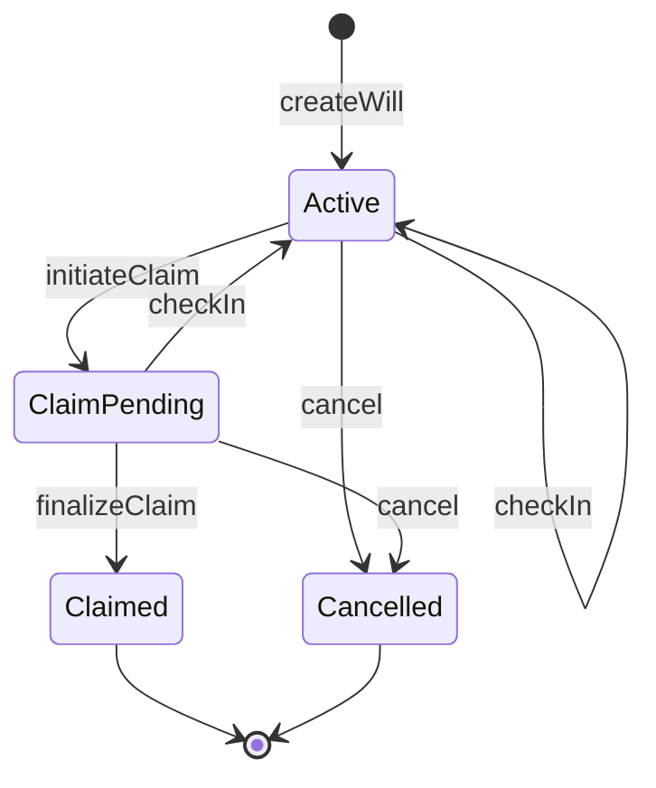

<p align="center">
  
</p>

<h1 align="center">CryptoWill — Contracts</h1>

<p align="center">
  A dead man's switch for self-custody inheritance, secured by World ID.<br />
  Owners prove they are alive; if they stop, their heir inherits — all enforced on-chain.
</p>

<p align="center">
  <a href="https://cryptowill-web.vercel.app/"><strong>Live demo</strong></a> ·
  <a href="https://github.com/party1168/cryptowill-web">Web app</a> ·
  <a href="https://sepolia.worldscan.org/address/0x1d3000d8fd4b8061e0766179f93f51de47d26143">Contract on Worldscan</a>
</p>

## Overview

An **owner** locks ETH in a will and names an **heir** by their anonymous World ID identifier. The owner keeps the will alive by periodically proving, with World ID, that they are still a living human. If the check-ins stop, the heir can claim — after a grace period, and only if the owner does not check in again during a challenge period.

There is no admin, no keeper and no off-chain service deciding anything: the contract derives every phase from timestamps and verifies every World ID proof on-chain through the `WorldIDRouter`.

## Deployment

| | |
| --- | --- |
| Network | World Chain Sepolia (chain ID 4801) |
| CryptoWill | [`0x1d3000d8fd4b8061e0766179f93f51de47d26143`](https://sepolia.worldscan.org/address/0x1d3000d8fd4b8061e0766179f93f51de47d26143) (block 34940301) |
| WorldIDRouter | `0x57f928158C3EE7CDad1e4D8642503c4D0201f611` |
| World ID app | `app_67b564360399a2545ef45ad95beb580d` (staging) |
| Actions | `cryptowill-alive-check`, `cryptowill-heir-claim` |

## Lifecycle

Only four states are stored. The finer-grained phase (Grace, Claimable, Finalizable) is derived from `lastCheckIn` and the three periods chosen at creation, so nobody has to pay gas to move a will forward.



| Transition | Called by | World ID proof | Allowed when |
| --- | --- | --- | --- |
| `createWill` | owner | owner | the wallet has no active will |
| `checkIn` | owner | owner | Active, or ClaimPending before the challenge period ends (voids the claim) |
| `initiateClaim` | anyone | heir | Active, after `checkInInterval + gracePeriod` |
| `finalizeClaim` | anyone | — | ClaimPending, after the challenge period |
| `cancel` | owner | owner | Active, or ClaimPending before the challenge period ends |

| Derived phase (`currentPhase`) | Condition |
| --- | --- |
| `Active` | `now < lastCheckIn + checkInInterval` |
| `Grace` | until `lastCheckIn + checkInInterval + gracePeriod` |
| `Claimable` | after that, while nobody has claimed |
| `Challenge` | claim pending, `now < claimInitiatedAt + challengePeriod` |
| `Finalizable` | claim pending, challenge period over |
| `Claimed` / `Cancelled` | final |

## World ID integration

Proofs are World ID 3.0 (legacy) proofs, verified on-chain with `WorldIDRouter.verifyProof(root, groupId = 1, signalHash, nullifierHash, externalNullifierHash, proof)` — Orb-verified humans only.

**Two actions, two external nullifiers.** Both are computed once in the constructor and stored as immutables:

```
externalNullifier = hashToField(abi.encodePacked(hashToField(appId), action))
hashToField(x)    = uint256(keccak256(x)) >> 8
```

| Action | Used by | Signal | Checked against |
| --- | --- | --- | --- |
| `cryptowill-alive-check` | `createWill`, `checkIn`, `cancel` | owner wallet (`msg.sender`) | `ownerNullifier` stored at creation |
| `cryptowill-heir-claim` | `initiateClaim` | payout address | `heirNullifier` stored at creation |

**Nullifiers are identities, not one-time tickets.** The usual World ID pattern marks a nullifier as used and rejects repeats. CryptoWill deliberately does not:

- The owner's nullifier is the same on every check-in, so it is stored once and compared on each call — never consumed. That is what makes repeated check-ins possible.
- A claim can happen only once per will because of the will's state machine, not a global nullifier registry — so the same person can be the heir of several wills.

**Signals bind proofs to addresses.** The owner's proof is bound to the owner's wallet, so a proof seen in the mempool is useless from any other wallet. The heir's proof is bound to the payout address, so anyone can relay a claim, but no relayer or front-runner can change where the funds go.

**Heirs have no address on-chain.** The heir is registered only by nullifier. `willIdsOfHeir(nullifier)` returns every will naming that heir, so the web app can show heirs their wills after a single World ID verification.

## Contract API

### Owner

| Function | Description |
| --- | --- |
| `createWill(root, nullifierHash, proof, heirNullifier, checkInInterval, gracePeriod, challengePeriod)` | Payable. Locks `msg.value` in a new will. One active will per wallet. |
| `checkIn(willId, root, nullifierHash, proof)` | Restarts the timer. During a pending claim's challenge period it also voids the claim. |
| `cancel(willId, root, nullifierHash, proof)` | Ends the will and returns the funds to the owner (until the challenge period ends). |

### Heir and anyone

| Function | Description |
| --- | --- |
| `initiateClaim(willId, payoutAddress, root, nullifierHash, proof)` | Starts the challenge period once the will is claimable. Callable by anyone holding the heir's proof. |
| `finalizeClaim(willId)` | Pays out to the recorded payout address after the challenge period. No proof needed. |

### Views

| Function | Returns |
| --- | --- |
| `wills(willId)` | Stored will data |
| `currentPhase(willId)` | Derived `WillPhase` |
| `claimableAt(willId)` | Earliest timestamp the heir can claim |
| `activeWillOf(owner)` | The owner's active will ID (0 if none) |
| `willIdsOfHeir(heirNullifier)` | All will IDs naming this heir |
| `aliveCheckExternalNullifier()`, `heirClaimExternalNullifier()` | World ID external nullifiers |

### Events

`WillCreated`, `CheckedIn`, `ClaimInitiated`, `ClaimChallenged`, `ClaimFinalized`, `WillCancelled`.

## Development

Built with [Foundry](https://book.getfoundry.sh).

```bash
git clone --recursive https://github.com/party1168/cryptowill.git
cd cryptowill
forge build
forge test
```

### Tests

- **Unit tests** (`test/CryptoWill.t.sol`) — 28 tests against a mock World ID that only accepts pre-registered `(root, signal, nullifier, externalNullifier)` tuples, so signal and nullifier binding are actually exercised: lifecycle, repeated check-ins, challenge and cancel paths, front-running protection, heir index, overflow-safe time math.
- **Fork tests** (`test/CryptoWill.fork.t.sol`) — run against the real WorldIDRouter on World Chain Sepolia, including full owner and heir lifecycles with real World ID proofs from the simulator. They are skipped unless the RPC URL is set:

```bash
WORLDCHAIN_SEPOLIA_RPC_URL=https://worldchain-sepolia.g.alchemy.com/public \
OWNER_PROOF_FIXTURE=test/fixtures/owner.json \
HEIR_PROOF_FIXTURE=test/fixtures/heir.json \
forge test --match-contract CryptoWillForkTest -vvv
```

See [`test/fixtures/README.md`](test/fixtures/README.md) for the fixture format.

### Deploy

```bash
cast wallet import cryptowill-dev --interactive   # once
WORLD_APP_ID=app_... forge script script/CryptoWill.s.sol \
  --rpc-url https://worldchain-sepolia.g.alchemy.com/public \
  --broadcast --account cryptowill-dev
```

The script targets World Chain Sepolia, uses the locked action strings, and prints both external nullifiers so they can be cross-checked with the web app.

## Repository structure

```
src/
  CryptoWill.sol            The will contract
  interfaces/IWorldID.sol   WorldIDRouter interface
  helpers/ByteHasher.sol    hashToField
script/CryptoWill.s.sol     Deployment script
test/
  CryptoWill.t.sol          Unit tests (mock World ID)
  CryptoWill.fork.t.sol     Fork tests (real WorldIDRouter, real proofs)
  fixtures/                 Real-proof fixtures (gitignored JSON)
broadcast/                  Deployment records
```
